# API Diagram Generator

## Purpose

Automatically create and maintain API flow diagrams whenever an API is created or its business flow changes.

The diagram must reflect the **actual implementation in the source code**, not assumptions or documentation.

The skill is responsible for:

* Detecting API creation or modification.
* Inspecting the complete API execution flow.
* Identifying controllers/routes, services, repositories, databases, external services, queues, events, and important business rules.
* Generating a Mermaid flow/sequence diagram.
* Updating an existing diagram when the API flow changes.
* Keeping diagrams organized inside the corresponding module's `/diagram` directory.
* Avoiding unnecessary diagram changes when the implementation change does not affect the API flow.

---

# 1. Directory Convention

Every module must have its own `diagram` directory.

Example:

```text
report/
├── controller/
├── service/
├── repository/
├── dto/
├── entity/
└── diagram/
    ├── create-report.md
    ├── create-report.mmd
    ├── get-report-detail.md
    └── get-report-detail.mmd
```

For another module:

```text
organization/
├── controller/
├── service/
├── repository/
└── diagram/
    ├── create-organization.md
    └── approve-organization.md
```

The diagram directory must always belong to the module that owns the API.

Do NOT create a global directory such as:

```text
docs/api/
```

unless the project already explicitly uses such a convention.

---

# 2. When This Skill Must Run

Run this skill when any of the following occurs:

### API creation

* New route/endpoint is created.
* New controller method is created.
* New RPC method is created.
* New GraphQL resolver is created.
* New API handler is created.

### API modification

Run when changes affect:

* Controller/route behavior.
* Request validation.
* Authentication.
* Authorization.
* Service/use-case logic.
* Repository/database operations.
* External service calls.
* Message broker operations.
* Event publishing.
* Queue operations.
* Transaction boundaries.
* Retry logic.
* Circuit breaker behavior.
* Saga/compensation flow.
* Business rules.
* Error handling.
* Response generation.

### Do NOT run for

Do not modify diagrams when changes are limited to:

* Formatting.
* Variable renaming without behavioral changes.
* Comments.
* Typo fixes.
* Documentation-only changes.
* Unit tests that do not change implementation.
* Import ordering.
* Pure code cleanup with identical behavior.

---

# 3. Core Principle

The source code is the source of truth.

Never generate a diagram based only on:

* API names.
* Controller names.
* Existing documentation.
* Ticket descriptions.
* Developer assumptions.
* Function names without inspecting their implementation.

Before generating or updating a diagram, inspect the actual execution path.

For example:

```text
POST /reports
      ↓
ReportController
      ↓
ReportService
      ↓
DuplicateImageService
      ↓
MediaRepository
      ↓
ReportRepository
      ↓
PostgreSQL
```

This flow must only be represented if the source code actually implements it.

---

# 4. Detect the API

When an API is created or modified, identify:

```text
HTTP Method
Route
Module
Controller / Handler
Service / Use Case
Request DTO
Response DTO
Authentication
Authorization
Database operations
External services
Events
Queues
Transactions
Error conditions
Business rules
```

Example:

```text
POST /api/v1/reports

Module:
report

Controller:
ReportController.create()

Service:
ReportService.createReport()

Request:
CreateReportDto

Response:
ReportResponse
```

---

# 5. Trace the Complete Execution Flow

Trace the API from entry point to final response.

The minimum investigation should include:

```text
Route
 ↓
Controller / Handler
 ↓
Validation
 ↓
Authentication / Authorization
 ↓
Service / Use Case
 ↓
Domain logic
 ↓
Repository
 ↓
Database
 ↓
External service
 ↓
Event / Queue
 ↓
Response
```

Not every API contains every layer.

Only include components that actually participate in the flow.

---

# 6. Inspect Indirect Calls

Do not stop after finding the controller.

For example:

```ts
ReportController.create()
```

calls:

```ts
reportService.create()
```

which calls:

```ts
duplicateImageService.check()
mediaService.create()
reportRepository.create()
```

The diagram must include these calls if they are meaningful to the API flow.

Continue tracing until reaching:

* Database.
* External API.
* Message broker.
* Queue.
* Event bus.
* Cache.
* File/object storage.
* Final response.
* Error boundary.

Avoid tracing irrelevant utility functions.

---

# 7. Identify Important Business Rules

Business rules that affect the API behavior must appear in the diagram.

Example:

```text
Image similarity > 85%
        ↓
Reject report
```

Represent this as a Mermaid `alt`, `opt`, or decision branch.

Example:

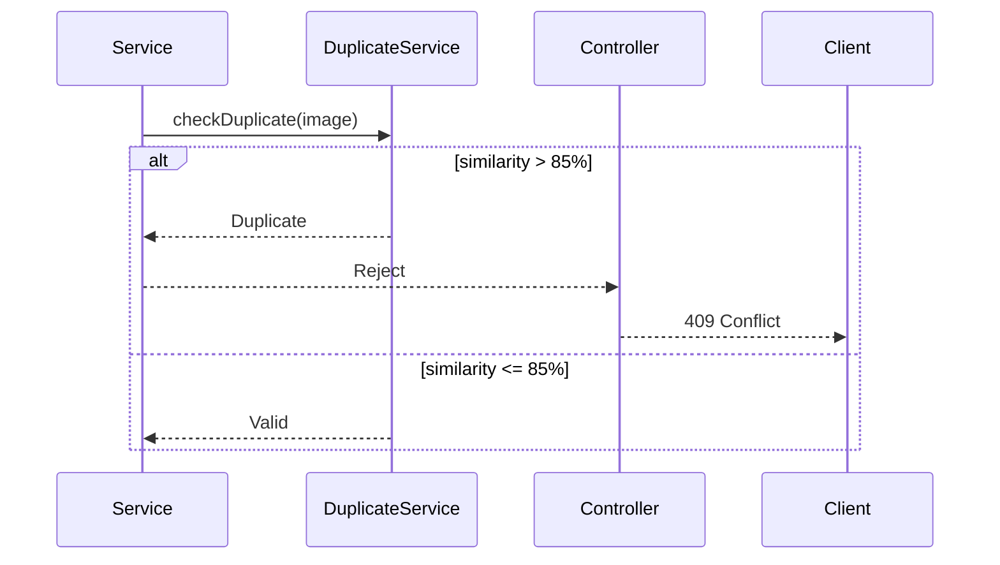

Do not hide important business rules inside generic boxes such as:

```text
Process report
```

---

# 8. Diagram Types

The default diagram type is a Mermaid `sequenceDiagram`.

Use it when the API contains interactions between multiple components.

Example:

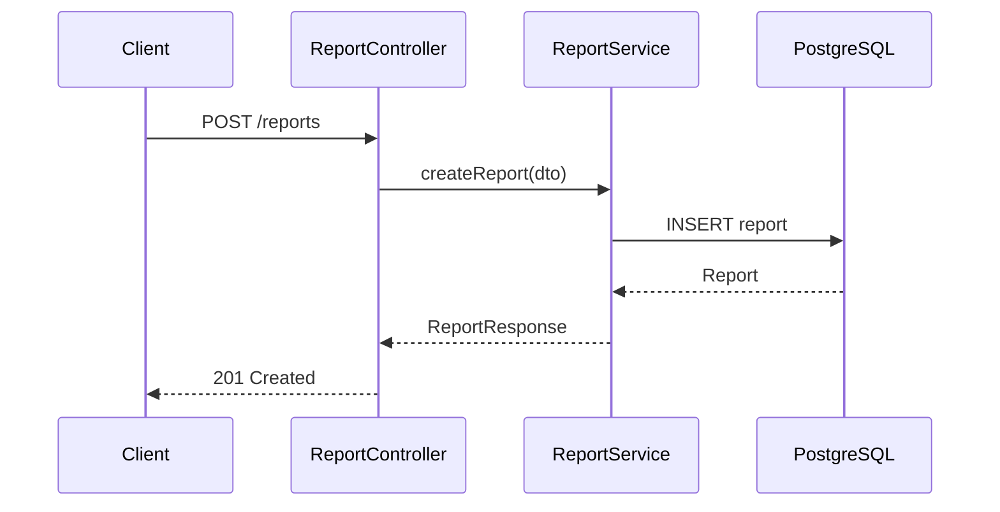

For simple APIs, a Mermaid `flowchart` may be used instead.

Example:

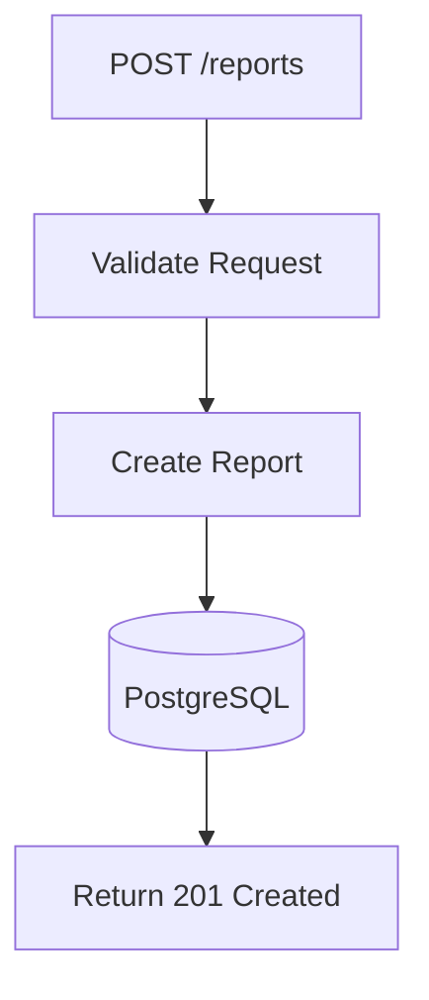

Prefer `sequenceDiagram` when the API involves meaningful component interactions.

Prefer `flowchart` when the API is primarily a decision/business flow.

---

# 9. File Naming Convention

Use:

```text
<operation-name>.mmd
<operation-name>.md
```

Examples:

```text
create-report.mmd
create-report.md

update-report.mmd
update-report.md

delete-report.mmd
delete-report.md

get-report-detail.mmd
get-report-detail.md
```

The operation name must be stable.

Do not rename the diagram merely because an internal function was renamed.

---

# 10. Markdown Documentation

Every `.mmd` file should have a corresponding `.md` file.

Example:

```text
report/
└── diagram/
    ├── create-report.mmd
    └── create-report.md
```

The Markdown file should contain:

````markdown
# POST /api/v1/reports

## Purpose

Create a new report.

## Flow

```mermaid
sequenceDiagram
    ...
````

## Business Rules

* Images must be checked for duplicates.
* Similarity greater than 85% causes the report to be rejected.

## Main Components

* ReportController
* ReportService
* DuplicateImageService
* MediaRepository
* ReportRepository
* PostgreSQL

````

Keep the Markdown concise.

The `.mmd` file is the canonical diagram source.

---

# 11. Updating Existing Diagrams

Before creating a diagram, always check:

```text
<module>/diagram/
````

Search for an existing diagram for the same API operation.

Example:

```text
report/diagram/create-report.mmd
```

If it exists:

1. Read the existing diagram.
2. Inspect the current source code.
3. Compare the existing diagram with the actual implementation.
4. Update only the affected flow.
5. Preserve unchanged sections.
6. Do not create a duplicate diagram.

---

# 12. Example of an API Update

Existing flow:

```text
Client
 ↓
ReportController
 ↓
ReportService
 ↓
ReportRepository
 ↓
PostgreSQL
```

A developer adds:

```text
DuplicateImageService
```

Before saving the report.

The diagram must become:

```text
Client
 ↓
ReportController
 ↓
ReportService
 ↓
DuplicateImageService
 ↓
ReportRepository
 ↓
PostgreSQL
```

with the appropriate decision branch:

```text
Duplicate?
 ├── Yes → Reject
 └── No  → Continue
```

Do not create:

```text
create-report-v2.mmd
create-report-new.mmd
create-report-updated.mmd
```

The existing diagram must be updated.

---

# 13. Detect Diagram Impact

After modifying an API, determine whether the diagram actually changed.

Use this classification:

### Level 0 — No impact

Examples:

```text
Rename variable
Formatting
Comment
Logging message
```

Action:

```text
Do not modify diagram.
```

### Level 1 — Internal implementation change

Example:

```text
Replace helper function with another helper
```

If the externally meaningful flow remains identical:

```text
Do not modify diagram.
```

### Level 2 — Flow change

Example:

```text
Add validation
Add repository call
Add external API
Add cache
Add queue
Add event
```

Action:

```text
Update diagram.
```

### Level 3 — Business behavior change

Example:

```text
Add duplicate detection
Change authorization
Add transaction
Add compensation
Add retry
Add circuit breaker
```

Action:

```text
Update diagram and Business Rules section.
```

---

# 14. External Services

External services must be represented explicitly.

Example:

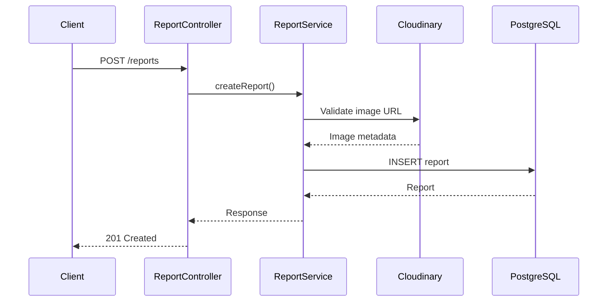

Do not represent external services as generic:

```text
External Service
```

Use the actual service name when known.

---

# 15. Database Operations

Show important database operations.

Examples:

```text
INSERT
SELECT
UPDATE
DELETE
UPSERT
TRANSACTION
```

Example:

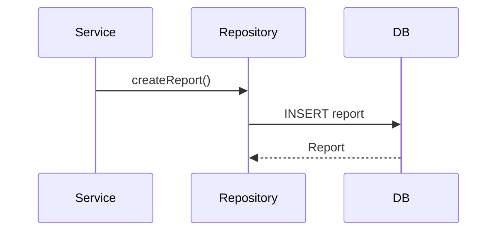

For transactions:

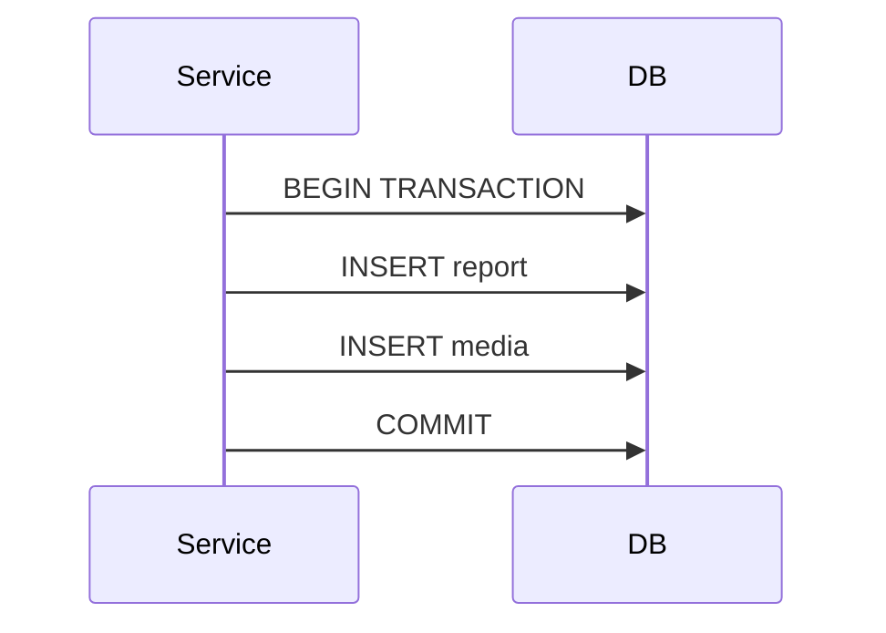

If rollback behavior is meaningful, show it.

---

# 16. Async Operations

For queues/events, distinguish synchronous and asynchronous operations.

Example:

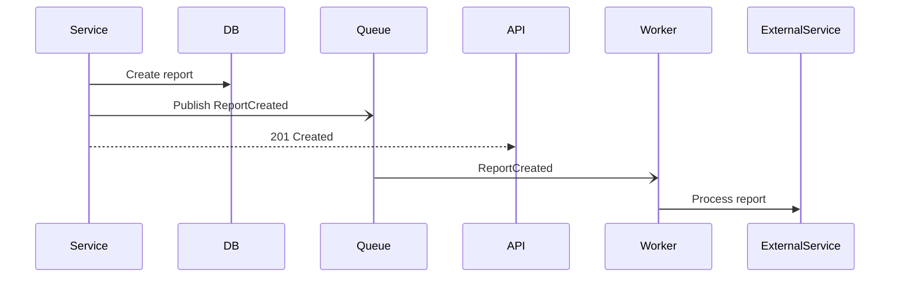

Use asynchronous arrows:

```text
-)
```

for events/messages where appropriate.

---

# 17. Error Handling

Important API errors must be represented.

Example:

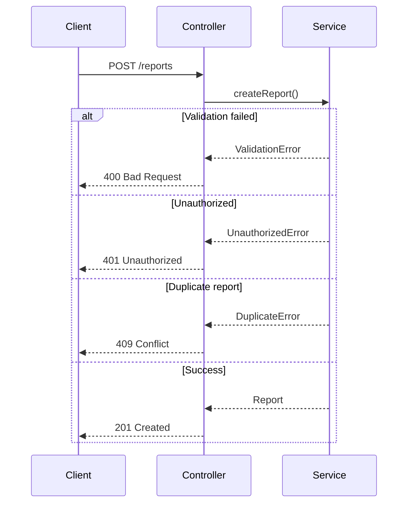

Only include meaningful error paths.

Do not create a huge diagram containing every possible exception.

---

# 18. Authentication and Authorization

If authentication or authorization affects the API flow, include it.

Example:

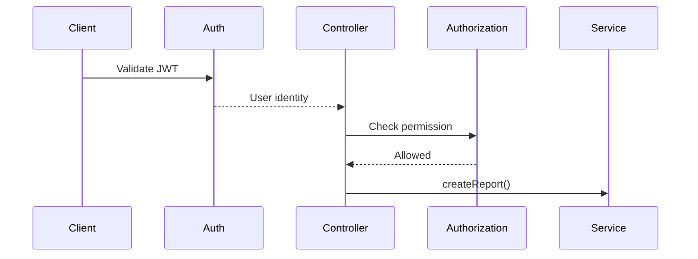

If authorization is middleware and does not materially affect the business flow, it may be represented as one concise step.

---

# 19. Transactions

If an API uses a transaction, the diagram must represent its boundary.

Example:

```text
BEGIN
  ↓
Create Report
  ↓
Create Media
  ↓
Create ReportMedia
  ↓
COMMIT
```

For rollback:

```text
BEGIN
  ↓
Operation A
  ↓
Operation B
  ↓
Failure
  ↓
ROLLBACK
```

Do not claim a distributed transaction unless the implementation actually uses one.

---

# 20. Saga / Compensation

If the implementation uses Saga or compensation logic, explicitly represent:

```text
Forward transaction
      ↓
Failure
      ↓
Compensation
```

Example:

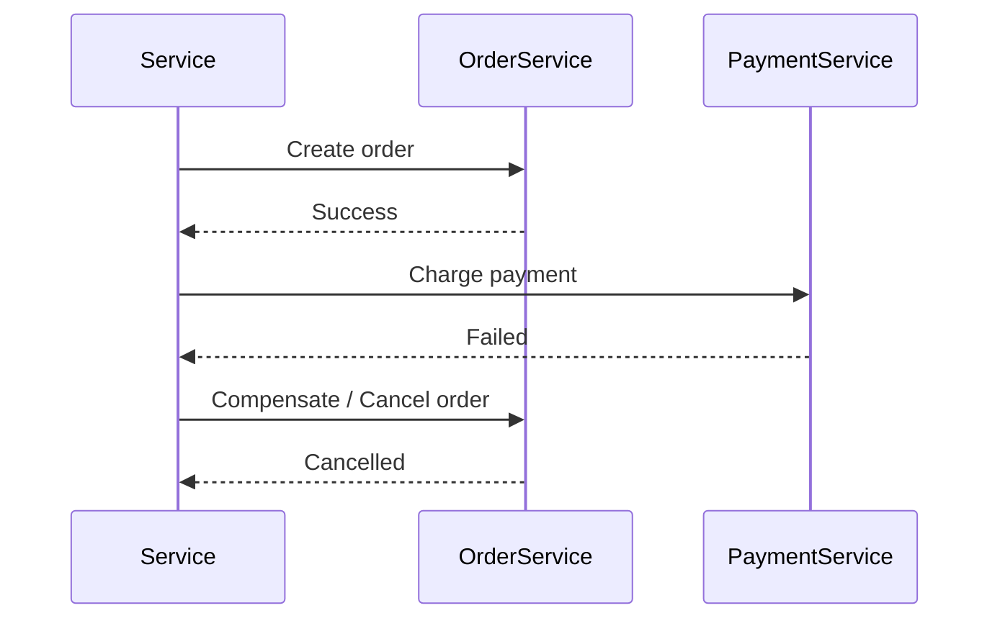

---

# 21. Circuit Breaker / Retry

If implemented, show it.

Example:

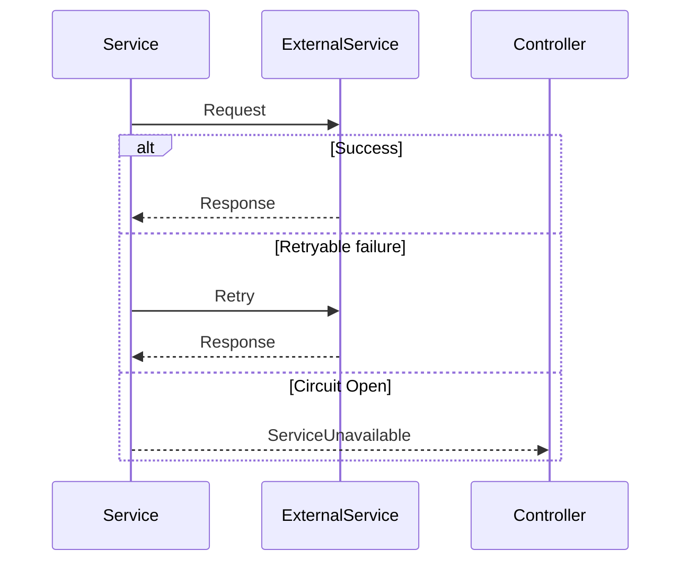

Do not add resilience patterns merely because they are recommended architecture.

Only document patterns that exist in the source code.

---

# 22. Diagram Quality Rules

Every diagram must:

* Reflect the current source code.
* Have a clear API entry point.
* Show the major components involved.
* Show important business decisions.
* Show important database operations.
* Show external service calls.
* Show async boundaries where relevant.
* Show meaningful error paths.
* Remain readable.

Avoid:

```text
100+ nodes
```

or diagrams that expose every trivial helper function.

The goal is to explain the API architecture and business flow, not reproduce the entire call stack.

---

# 23. Naming Participants

Use readable names.

Prefer:

```text
participant API as ReportController
participant S as ReportService
participant DB as PostgreSQL
```

instead of:

```text
participant RC as com.company.report.controller.ReportControllerImpl
```

The diagram should be understandable by developers who know the module but do not need package-level details.

---

# 24. Preserve Existing Diagram Structure

When updating an existing diagram:

* Preserve participant ordering when possible.
* Preserve naming.
* Preserve existing sections that are still valid.
* Modify only affected flows.
* Avoid unnecessary formatting changes.
* Avoid regenerating the entire file if a small change is sufficient.

This keeps Git diffs small and reviewable.

---

# 25. Git Diff Awareness

Before finalizing a diagram update, inspect the diff.

The expected change should correspond to the implementation change.

Example:

```text
Code change:

+ DuplicateImageService
+ duplicate detection
+ 409 Conflict

Expected diagram diff:

+ DuplicateImageService
+ duplicate decision branch
+ 409 Conflict
```

If the diagram changes substantially while the API implementation changed only slightly, review the diagram before committing it.

---

# 26. Required Workflow

Whenever this skill is triggered, follow this workflow:

```text
1. Identify changed API
        ↓
2. Identify owning module
        ↓
3. Locate <module>/diagram/
        ↓
4. Find existing diagram
        ↓
5. Inspect API entry point
        ↓
6. Trace service/use-case flow
        ↓
7. Trace repositories/database
        ↓
8. Trace external services
        ↓
9. Trace queues/events
        ↓
10. Identify business rules
        ↓
11. Identify error paths
        ↓
12. Compare with existing diagram
        ↓
13. Determine whether diagram needs update
        ↓
14. Create or update .mmd
        ↓
15. Update corresponding .md
        ↓
16. Verify diagram against source code
        ↓
17. Inspect git diff
```

---

# 27. Example Module Structure

For the `report` module:

```text
report/
├── controller/
│   └── report.controller.ts
│
├── service/
│   ├── report.service.ts
│   └── duplicate-image.service.ts
│
├── repository/
│   ├── report.repository.ts
│   └── media.repository.ts
│
├── dto/
│   ├── create-report.dto.ts
│   └── report-response.dto.ts
│
├── entity/
│   ├── report.entity.ts
│   └── media.entity.ts
│
└── diagram/
    ├── create-report.mmd
    ├── create-report.md
    ├── get-report-detail.mmd
    └── get-report-detail.md
```

---

# 28. Example create-report.mmd

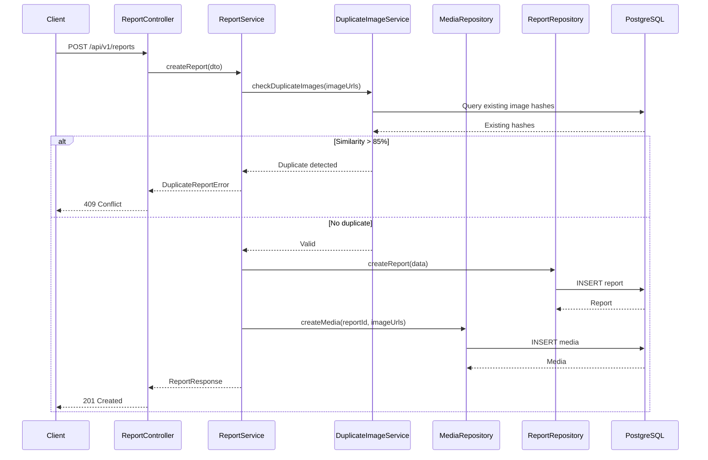

---

# 29. Example create-report.md

```markdown
# POST /api/v1/reports

## Purpose

Create a new report and associate uploaded images with the report.

## Flow

See `create-report.mmd`.

## Business Rules

- Images are checked for duplicate reports before creating a new report.
- If image similarity is greater than 85%, the report is rejected.
- Duplicate reports return `409 Conflict`.
- Valid reports are persisted together with their media records.

## Main Components

- `ReportController`
- `ReportService`
- `DuplicateImageService`
- `ReportRepository`
- `MediaRepository`
- `PostgreSQL`
```

---

# 30. Final Validation

Before completing an API task, verify:

```text
[ ] API flow was inspected from entry point to response.
[ ] Owning module was identified.
[ ] <module>/diagram/ exists.
[ ] Existing diagram was checked.
[ ] Existing diagram was updated instead of duplicated.
[ ] New diagram was created when necessary.
[ ] Business rules are represented.
[ ] Important database operations are represented.
[ ] External services are represented.
[ ] Async operations are represented.
[ ] Important error paths are represented.
[ ] Diagram matches current source code.
[ ] Markdown documentation matches the diagram.
[ ] Git diff does not contain unnecessary diagram changes.
```

The final response after implementing an API should briefly mention:

```text
API implementation completed.

Diagram:
<module>/diagram/<operation>.mmd

Documentation:
<module>/diagram/<operation>.md

Diagram status:
Created / Updated / No flow change
```

Do not claim a diagram was updated unless the file was actually created or modified.
