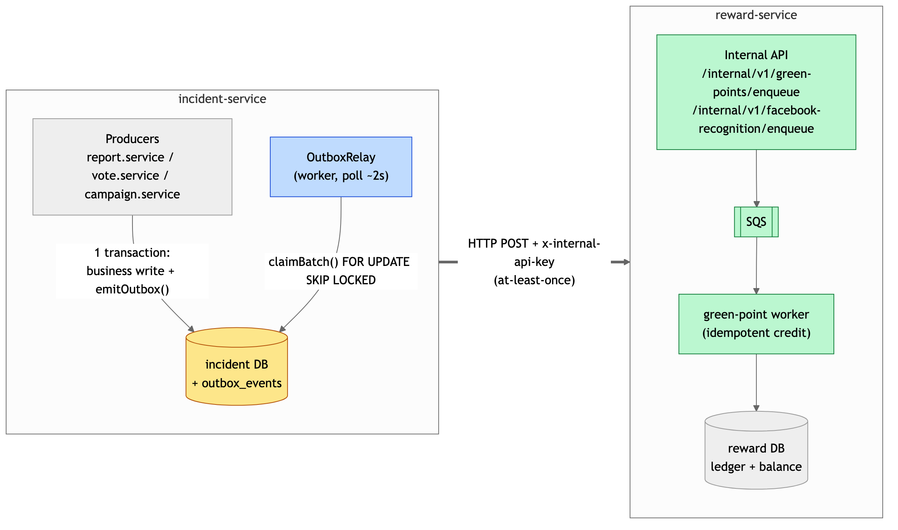
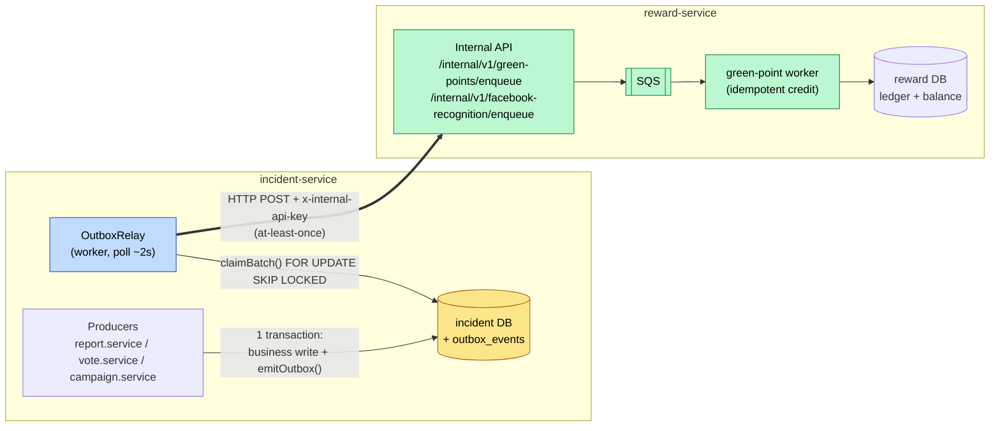
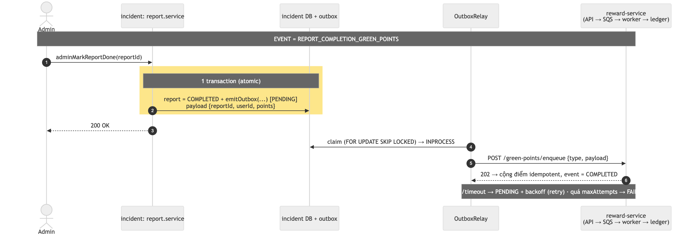
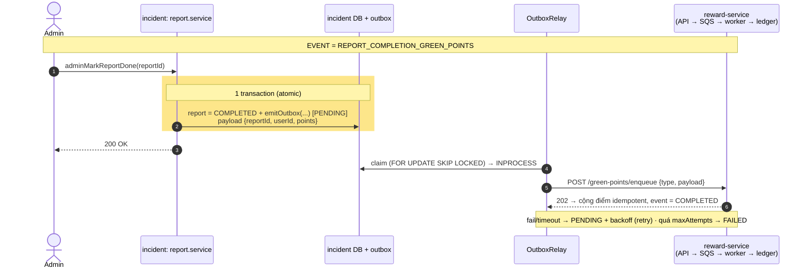
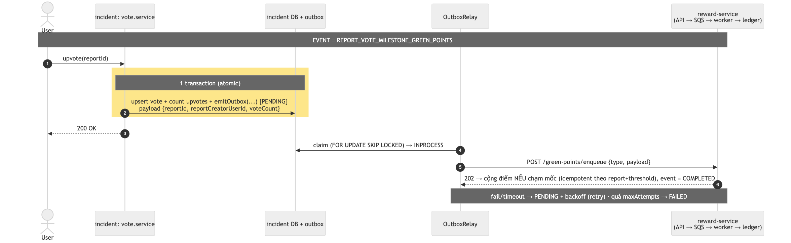
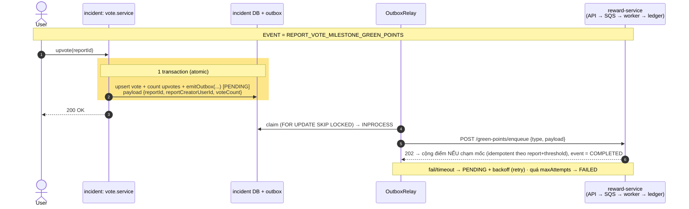
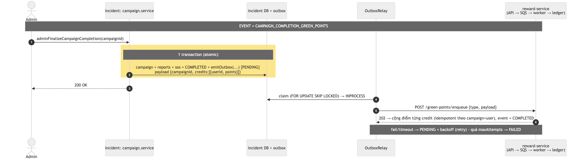
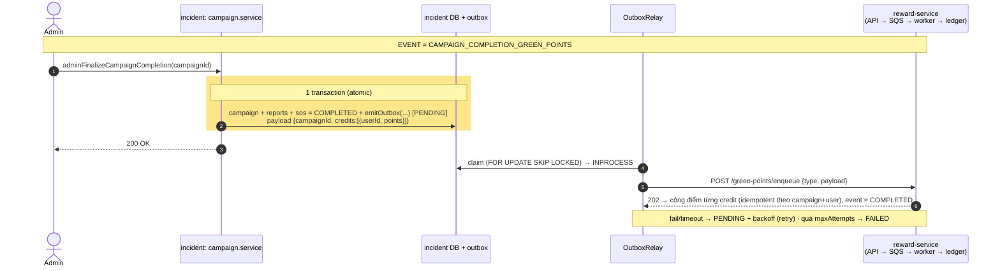
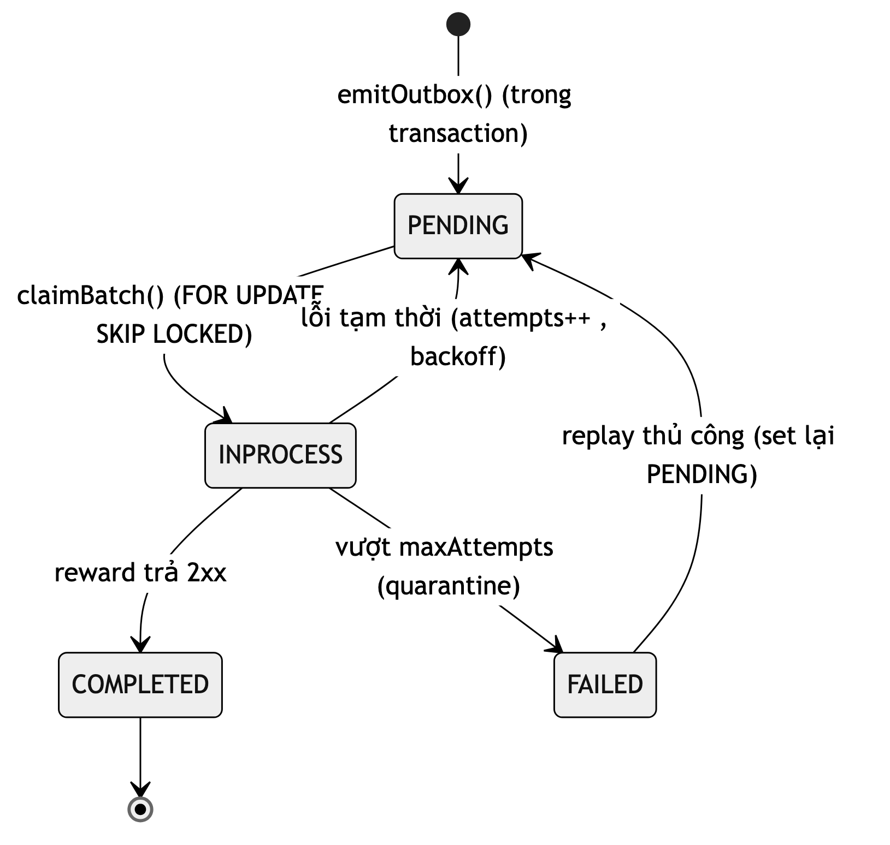
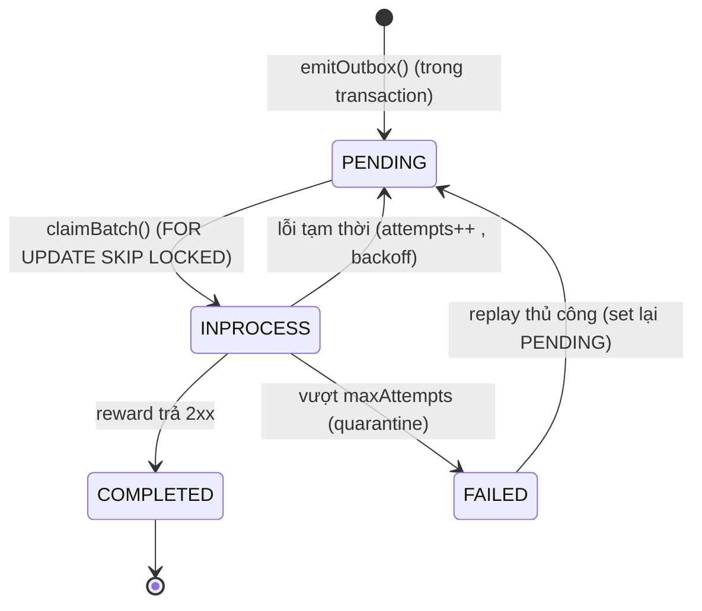

# Outbox flows — incident-service

Mỗi luồng dùng **Transactional Outbox** được vẽ thành **1 sơ đồ end-to-end** đầy đủ:
producer → transaction → `outbox_events` → relay → reward-service (consumer), kèm
**tên event** và các nhánh **success / retry / failed**.

> Quy ước chung cho cả 3 luồng:
> - `incident-service` ghi business data **+** `emitOutbox()` trong **cùng 1 transaction** (atomic, không dual-write).
> - `OutboxRelay` (worker của incident) đọc `outbox_events`, **đẩy HTTP** sang `reward-service`. Giao **at-least-once**.
> - `reward-service` nhận → đẩy **SQS** → worker cộng điểm **idempotent** (gửi trùng không cộng dồn).

**Ảnh render sẵn (`images/`):**
[01 toàn cảnh](images/01-overview.png) ·
[02 report done](images/02-flow-report-done.png) ·
[03 vote milestone](images/03-flow-vote-milestone.png) ·
[04 campaign completion](images/04-flow-campaign-completion.png) ·
[05 state machine](images/05-state-machine.png)

> Tái tạo ảnh nét cao sau khi sửa sơ đồ:
> `npx -y @mermaid-js/mermaid-cli -i outbox-flows.md -o images/r.md -e png -t neutral -b white -s 3`
> (xoá `images/r.md`, đổi tên `images/r-*.png` cho khớp).

---

## Toàn cảnh: service nào nói chuyện với service nào

---

## Flow 1 — Mark report done

| | |
|---|---|
| **Producer** | `report.service.adminMarkReportDone()` |
| **Event** | `REPORT_COMPLETION_GREEN_POINTS` |
| **dedupKey** | `REPORT_COMPLETION_GREEN_POINTS:<reportId>` |
| **Endpoint reward** | `POST /internal/v1/green-points/enqueue` |

---

## Flow 2 — Upvote đạt mốc → thưởng người tạo report

| | |
|---|---|
| **Producer** | `vote.service.upvote()` → `emitReportVoteMilestoneIfNeeded()` |
| **Event** | `REPORT_VOTE_MILESTONE_GREEN_POINTS` |
| **dedupKey** | `REPORT_VOTE_MILESTONE_GREEN_POINTS:<reportId>:<voteCount>` (mỗi mốc vote là 1 event) |
| **Endpoint reward** | `POST /internal/v1/green-points/enqueue` |

---

## Flow 3 — Hoàn tất campaign → cộng điểm volunteer đã check-in

| | |
|---|---|
| **Producer** | `campaign.service.adminFinalizeCampaignCompletion()` |
| **Event** | `CAMPAIGN_COMPLETION_GREEN_POINTS` |
| **dedupKey** | `CAMPAIGN_COMPLETION_GREEN_POINTS:<campaignId>` |
| **Endpoint reward** | `POST /internal/v1/green-points/enqueue` |
| **Ghi chú** | `CAMPAIGN_FACEBOOK_RECOGNITION` đang TODO; khi bật sẽ đẩy sang `/internal/v1/facebook-recognition/enqueue` |

---

## Trạng thái của 1 outbox event

> `FAILED` không tự xử lý — sửa nguyên nhân rồi đưa event về `PENDING` để relay giao lại.
> Dữ liệu event vẫn còn nguyên (payload đủ userId/points) nên **không mất điểm**.
