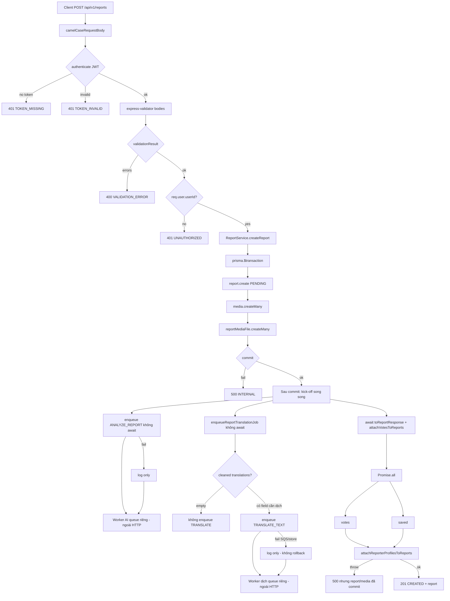

# 8. Flow Diagram

`POST /api/v1/reports` — Client → Controller → Validation → Service → Database / External → Response.

**Tuần tự (phụ thuộc bước trước):** auth → validate → transaction (`report` → `media` → `report_media_files` → commit).

**Song song sau commit (không `await` queue):** kick-off `ANALYZE_REPORT` và `TRANSLATE_TEXT` rồi chạy `attachVotesToReports`. HTTP **không** đợi SQS / worker. Trong `attachVotesToReports`, votes và saved chạy `Promise.all`; profile identity chạy sau khi hai query đó xong.

