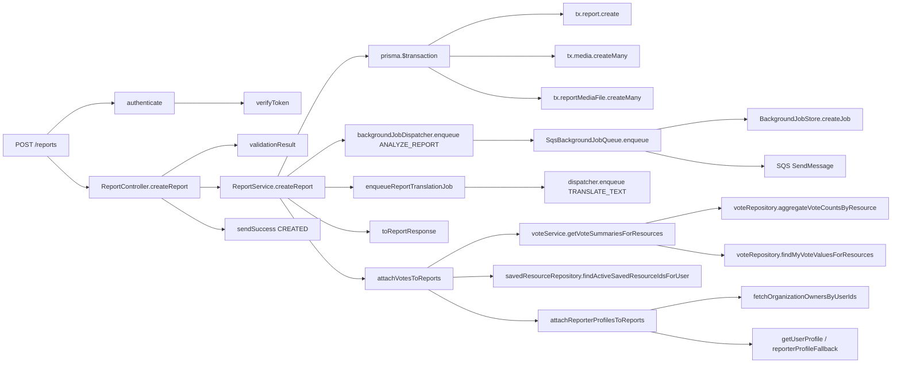

# 9. Call Graph

Call chain của `POST /api/v1/reports`.

```mermaid
flowchart LR
  POST["POST /reports"] --> AUTH["authenticate"]
  AUTH --> VT["verifyToken"]
  POST --> CR["ReportController.createReport"]
  CR --> VR["validationResult"]
  CR --> CS["ReportService.createReport"]
  CS --> TX["prisma.$transaction"]
  TX --> RC["tx.report.create"]
  TX --> MC["tx.media.createMany"]
  TX --> RMF["tx.reportMediaFile.createMany"]
  CS --> DISP["backgroundJobDispatcher.enqueue ANALYZE_REPORT"]
  DISP --> SQS["SqsBackgroundJobQueue.enqueue"]
  SQS --> CJ["BackgroundJobStore.createJob"]
  SQS --> SM["SQS SendMessage"]
  CS --> TR["enqueueReportTranslationJob"]
  TR --> DISP2["dispatcher.enqueue TRANSLATE_TEXT"]
  CS --> TRR["toReportResponse"]
  CS --> AV["attachVotesToReports"]
  AV --> VS["voteService.getVoteSummariesForResources"]
  VS --> VAC["voteRepository.aggregateVoteCountsByResource"]
  VS --> VMV["voteRepository.findMyVoteValuesForResources"]
  AV --> SR["savedResourceRepository.findActiveSavedResourceIdsForUser"]
  AV --> AP["attachReporterProfilesToReports"]
  AP --> ID["fetchOrganizationOwnersByUserIds"]
  AP --> GP["getUserProfile / reporterProfileFallback"]
  CR --> SS["sendSuccess CREATED"]
```
